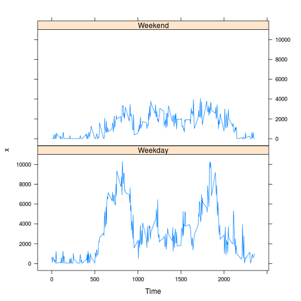

# Reproducible Research: Peer Assessment 1

## Loading and preprocessing the data


```r
data =  read.csv("activity.csv", stringsAsFactors=FALSE)
data$date= as.Date(data$date, format="%Y-%m-%d")
```


## What is mean total number of steps taken per day?

The histogram of the total number of steps taken each day

```r
data2 = data[!is.na(data$steps),1:3]
result2 = tapply(data2$steps, list(data2$date), sum)
hist(result2, xlab = "Total Steps Per Day", ylab = "Frequency", 
              main="Total Number of Steps Per Day")
```

 

```r
cat("Mean is", mean(result))
```

```
## Mean is 10766
```

```r
cat("Median is", median(result))
```

```
## Median is 10765
```

## What is the average daily activity pattern?


```r
data3 = data2[,c(1,3)]
result3 = tapply(data3$steps, data3$interval, mean)
x = strptime(sprintf("%04d", as.numeric(names(result3))), "%H%M")
plot(x, result3, type="l", xlab="Time", ylab="Average Number of Steps",
     main = "Average Daily Activity Patterns")
```

 

```r
t = sprintf("%04d", as.numeric(names(which(result3==max(result3)))))
cat("The five minute interval from ", format(strptime(t, "%H%M"), "%T"), " ,on average across all the days in the dataset, contains the maximum number of steps")
```

```
## The five minute interval from  08:35:00  ,on average across all the days in the dataset, contains the maximum number of steps
```


## Imputing missing values

The approach to handle the NA (missing values) here is to use the time series package zoo to simplify the handling. Basically, the each NA value is replaced with the most recent non-NA value prior to it.

This impact of taking this approach is the mean/median so calculated will be much greater than those calculated previuosly with NA data removed.


```r
library(xts)
library(zoo)
cat("The number records missing values is ", summary(is.na(data$steps))[["TRUE"]])
```

```
## The number records missing values is  2304
```

```r
data4 = data.frame(steps=data$steps, datetime=strptime(paste(data$date, sprintf("%04d", data$interval)), "%Y-%m-%d %H%M"))
data4n1 = zoo(data4)
data4n2 = na.locf(data4n1, fromLast=TRUE)
data4n3 = as.data.frame(data4n2[!is.na(data4n2$steps)], stringsAsFactors=FALSE)
rownames(data4n3) = NULL
data4n3$steps <- as.numeric(data4n3$steps)
data4n3$datetime <- as.character(data4n3$datetime)

result4 = tapply(data4n3$steps, substring(data4n3$datetime, 1, 10), sum)
hist(result4, xlab = "Total Steps Per Day", ylab = "Frequency", 
              main="Total Number of Steps Per Day")
```

 

```r
cat("Mean is", mean(result4))
```

```
## Mean is 21100
```

```r
cat("Median is", median(result4))
```

```
## Median is 24024
```

## Are there differences in activity patterns between weekdays and weekends?

```r
library("lattice")
data5 = data4n3
data5["date"] = NULL
data5["date"] = weekdays(as.Date(substr(data4n3$datetime, 1, 10), format = "%Y-%m-%d"))
data5["day"] = NULL
data5["day"] = ifelse((data5$date == "Saturday" | data5$date == "Sunday"), "Weekend", "Weekday")

data5n1 = data.frame(steps=data5$steps, time=substring(data5$datetime, 12, 19), day=data5$day)
result5 = aggregate(data5n1$steps, list(data5n1$time, data5n1$day), FUN = sum)
xyplot(x ~ as.numeric(gsub(pattern=":", replacement="", as.character(Group.1)))/100 | factor(Group.2), data= result5, type ="l", layout=c(1,2), xlab="Time")
```

 

